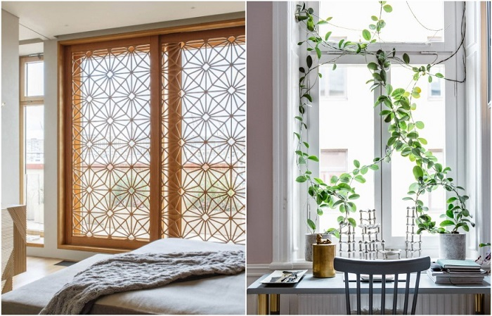
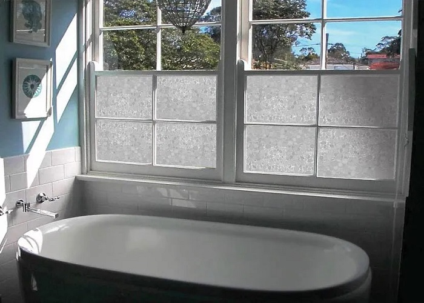
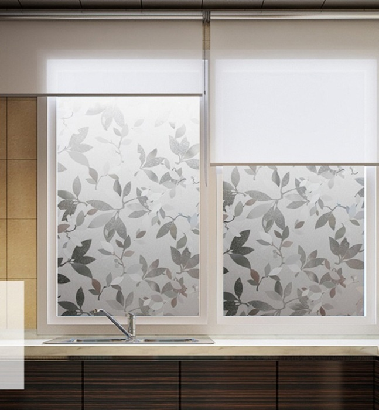
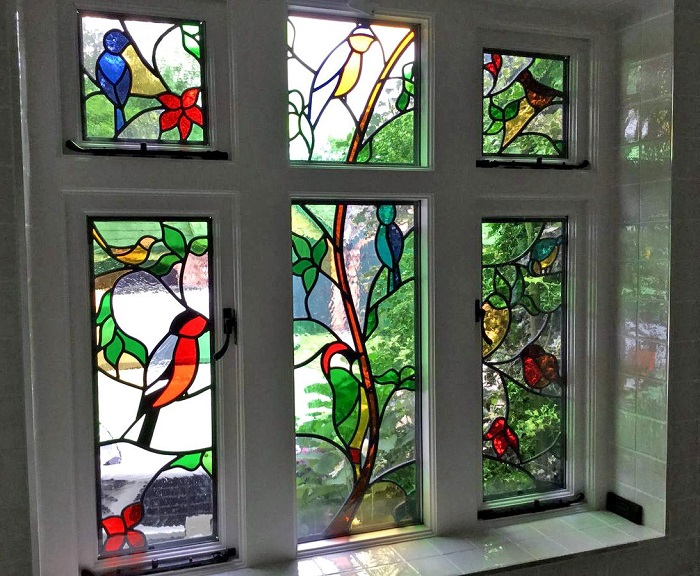

# Ideas for replacing classic window curtains to get a wow effect

For many years, you could only see curtains on the windows in apartments, which were considered the only possible option for decor. However, times have changed, and today even the bare windows do not surprise anyone. Novate.ru advises to make do with less drastic measures and to use one of the modern variants, presented below, instead of curtains.

## Option 1: Frosted glass

Curtains allow us to protect our personal space, and when we remove them, we immediately lose control over the privacy of the room. In addition, there is the question of what to do with the streams of daylight that enter the room unobstructed. Both problems can easily be solved by frosted glass, which protects the room from direct sunlight. Note that it is not necessary to make the window completely frosted. You can cover just a part of it, or you can sandblast a picture on the glass.

## Option 2: Decorative stickers

People who love creativity may like the option with decorative adhesive tape. It will allow you to reveal the talent of the artist and create a whole picture on the window. In the store you can find a variety of options, ranging from flowers, and ending with winged phrases that glow in the dark. Try to choose only those types of adhesive film that are easily removable - in this case, you can easily change the drawings to suit your mood or depending on the season.

## Option 3: Stained Glass Fragments

Contrary to popular opinion, stained glass windows fit harmoniously not only in a classic interior. If you choose the right color scheme, as well as competently beat them and add to the room a few elements in a similar style, they will look great in a modern setting. Please note that the effect of the stained glass window will directly depend on the size of the window - the larger it is, the better the picture will look.

Take note: If the apartment has non-standard windows, which are located in the middle of the wall, you can build a decorative screen around them. This way you can correct the proportions without interfering with the architecture of the facades.

